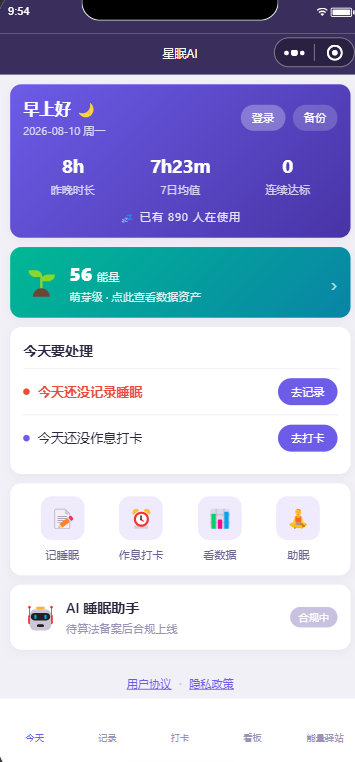
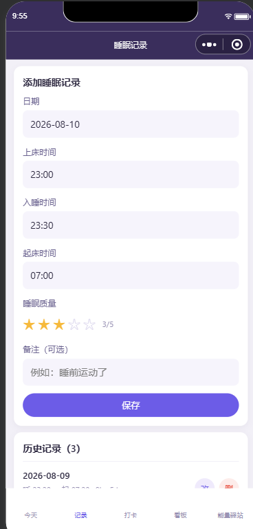
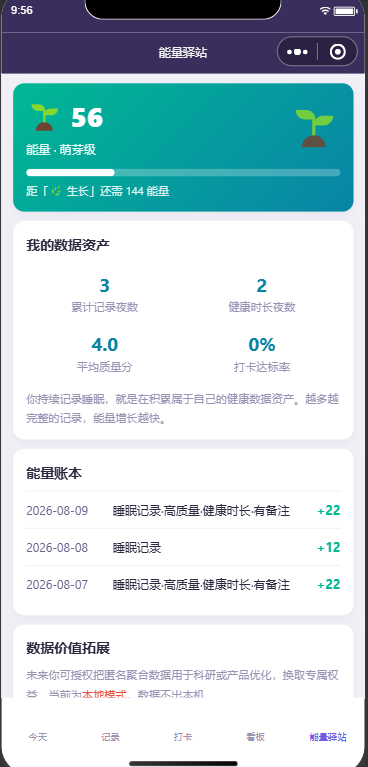
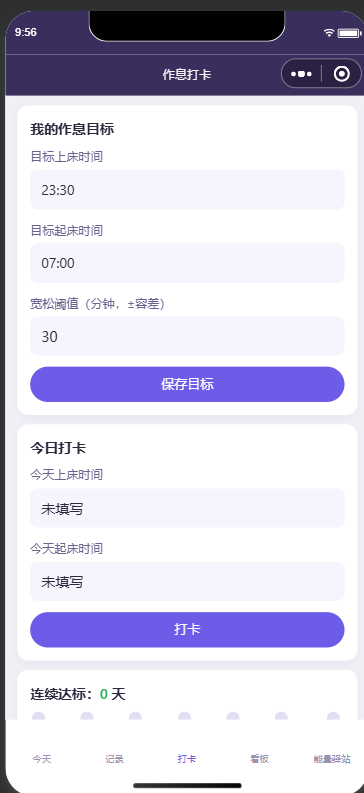
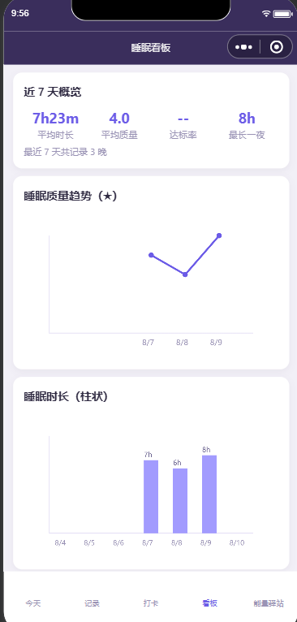
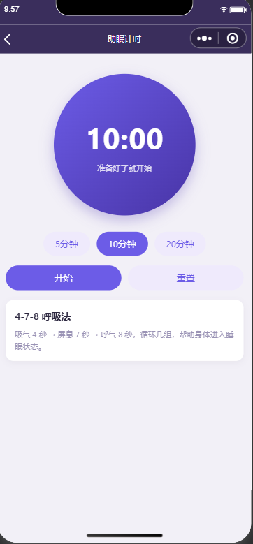

# Xingmian AI · Sleep-Health WeChat Mini-Program

> A personal sleep-health companion for insomniacs and the overworked, paired with an enterprise "Burnout Radar" and a data-asset "Energy Station" — forming a product matrix of **personal data cultivation → anonymous aggregation → enterprise revenue**.


---

## ✨ Highlights

- **Four core sleep modules**: sleep logging, routine check-in, sleep dashboard (hand-drawn trend charts), and a sleep-aid timer — covering the "log → rhythm → insight → relax" loop.
- **Energy Station (data flywheel start)**: quantifies sleep logs / check-ins into "data energy" and "data assets", so users feel they are accumulating valuable health data even without a backend.
- **Compliance-first**: privacy consent pop-up, content-moderation interception (no medical claims), full user agreement / privacy policy — can launch compliantly without qualifications.
- **Privately deployable backend**: zero-native-dependency Node + Express service (JSON file storage), with a one-click Tencent Cloud CVM deploy script — your data stays in your hands.
- **Local mode ↔ real backend seamless switch**: flip one switch (`config/compliance.js`) between "pure local" and "phone-number real login + cloud sync" without touching business code.

## 📷 Screenshots

| Home | Sleep Log | Energy Station |
| :---: | :---: | :---: |
|  |  |  |
| **Routine Check-in** | **Sleep Dashboard** | **Sleep Timer** |
|  |  |  |

---

## 🧩 Product Matrix

| Product | Positioning | Status |
| ---------- | ----------------------------------------- | ---------------- |
| ① **Anxinmian (Peaceful Sleep)** | Personal sleep-health management (log / check-in / dashboard / timer); long-term compliance moat, advanced independently | ✅ MVP-1 released form |
| ② **Burnout Radar** | Enterprise employee burnout-risk early warning (survey + heatmap + alert loop); the revenue cash cow | 🔜 After security rating + DPA |
| ③ **Energy Station** | Personal data-asset visualization (energy / level / ledger); the data-cultivation flywheel | ✅ Live (local mode) |

**Closed loop**: personal data cultivation → anonymous aggregation → enterprise revenue → feeds back to individuals / strengthens the moat.

---

## 🛠 Architecture

```
┌─────────────────────┐         HTTPS / Bearer Token         ┌──────────────────────┐
│  WeChat Mini-Program │  ───────────────────────────────▶  │   Node + Express API  │
│  Native WXML/WXSS/JS │  ◀───────────────────────────────  │  JSON file storage    │
│  Local-first / backend│        (local mode = fully offline) │  Tencent CVM / CloudBase │
└─────────────────────┘                                     └──────────────────────┘
```

- **Frontend**: native WeChat mini-program (no framework, avoids SWC transpile pitfalls); data stored locally first via `wx.setStorageSync`.
- **Backend**: `server/` zero-native-dependency Express, storage isolated per phone number, AppSecret only via env vars.
- **Deployment**: frontend uploaded via WeChat DevTools; backend via `server/deploy-cvm.sh` one-click to Tencent Cloud.

---

## 🚀 Quick Start

### Mini-program frontend (WeChat DevTools)

1. Open the repo root with WeChat DevTools.
2. Fill in your mini-program AppID in `project.config.json` (currently `wxe32f899ba0d86bf3` — replace with your own).
3. Compile and preview; defaults to **local mode**, data stored on device.

### Backend (local verification)

```bash
cd server
cp .env.example .env        # keep DEV_MODE=true locally (allows devPhone bypass login)
npm install
npm start                  # default http://localhost:3000
# health check: curl http://localhost:3000/
```

### Connect to the real backend (frontend switch)

Edit `config/compliance.js`:

```js
BACKEND_SYNC: { enabled: true, apiBase: 'https://your-domain' }
```

And add the domain under WeChat console → "Server Domains → request legal domains".

---

## 📁 Directory Structure

```
.
├── app.js / app.json / app.wxss      # mini-program entry & global config
├── pages/                           # pages: index/record/routine/dashboard/timer/energy/ai/agreement/privacy/login
├── utils/                           # api.js (request wrapper) / audit.js (content moderation) / energy.js (energy calc)
├── config/compliance.js             # unified compliance / feature switches (local mode ↔ real backend)
├── cloudfunctions/syncSleep/        # cloud function placeholder
├── server/                          # backend: Express + JSON storage + Tencent CVM deploy scripts
│   ├── server.js / src/             # entry & routes / config / storage / wechat decrypt / middleware
│   ├── deploy-cvm.sh / setup-https.sh / DEPLOY-CVM.md
│   └── README.md
├── 一体化产品矩阵-产品开发与合规文档.md   # strategy + compliance baseline
└── 分阶段开发实施计划.md               # engineering roadmap
```

---

## 🔐 Compliance Notes

- **Launchable without qualifications (done)**: privacy guidance published, separate-consent pop-up, content-moderation interception, user agreement / privacy policy, compliance switch centralized.
- **After qualifications / filing**: generative-AI sleep assistant (needs algorithm filing); enterprise Burnout Radar (needs security rating + DPA + employee separate consent); ① Anxinmian licensed route (no "treatment" claims before SaMD Class-II filing).
- Legal conclusions require final confirmation by a practicing lawyer / compliance advisor; market data are public-source inferences and need first-hand verification before launch.

---

## 📦 Deploy to Tencent Cloud

See [`server/DEPLOY-CVM.md`](./server/DEPLOY-CVM.md): purchase CVM / Lighthouse → upload `server/` → `bash deploy-cvm.sh` → `DOMAIN=your-domain bash setup-https.sh` → flip the frontend switch back.

---

## 🗺 Roadmap

| Phase | Scope | Status |
| --------- | ----------------------- | -------------- |
| Phase 0 | Compliance base (agreement / pop-up / moderation / switch) | ✅ Done |
| Phase 1 | ③ Energy Station + ① Anxinmian enhancement | ✅ Done |
| Phase 1.5 | Generative-AI sleep assistant | 🔜 After algorithm filing (placeholder) |
| Phase 2 | ② Burnout Radar (enterprise) | 🔜 Needs project approval / security rating |
| Phase 3 | Cross-device sync / data aggregation | 🔜 Needs project approval |

---

## 🏢 Development & Copyright

- **Developer**: Jinjiang Feihongzhi Technology Enterprise Management Co., Ltd. · Feiyang Qiyuan R&D Center
- **Lead**: Wu Cihong
- **Project**: Xingmian AI (WeChat mini-program + privately deployable Node backend)

> Copyright belongs to Jinjiang Feihongzhi Technology Enterprise Management Co., Ltd.

---

## 🌐 Official Site & Related Open-Source Projects

Maintained by **Jinjiang Feihongzhi Technology Enterprise Management Co., Ltd. · Feiyang Qiyuan R&D Center**, part of the Feihongzhi klAI open-source ecosystem.

- 🏠 **Official site**: [https://klai.top](https://klai.top) — Feihongzhi klAI · Quanzhou manufacturing-AI service provider
- 📦 **Open-source matrix**: [https://klai.top/opensource.html](https://klai.top/opensource.html)
- 📚 **AI knowledge base**: [https://kb.klai.top](https://kb.klai.top) — product docs & smart Q&A (MaxKB-powered)

**Related projects**:

| Project | Description |
|------|------|
| [GEO-SaaS](https://github.com/wch887292/geo-saa) | AI-driven GEO search optimization platform |
| [Feihongzhi Enterprise AI Platform](https://github.com/wch887292/fyqy-ai-agent) | AI-native integrated management platform for SME manufacturers |
| [FyqyClaw](https://github.com/wch887292/FyqyClaw) | Full-lifecycle AI-driven dev tool (IDE + AI Agent) |
| [Xingmian AI](https://github.com/wch887292/xmai) | Sleep-health WeChat mini-program + private-deployable backend (this repo) |

> ⭐ If this project helps you, please **Star** and share it so more people discover the Feihongzhi open-source ecosystem!

---

## 📄 License & Contact

This is a **commercial project**; for code licensing please contact the author. We welcome collaboration on sleep-health products / enterprise burnout-management solutions.

> Originally named "AI Sleep Assistant"; renamed to **Xingmian AI**. "Energy Bank" was renamed to **Energy Station**.
